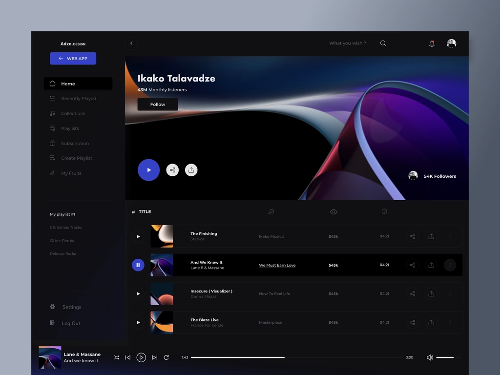
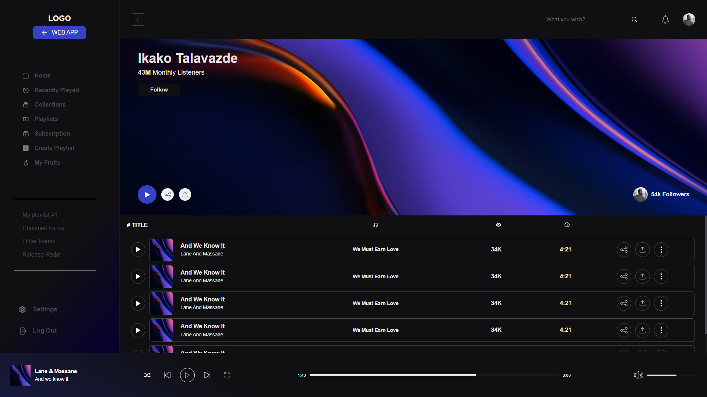

Design
;

Current build
;

The UI is based on design by IKAKO from dribble.
Here is the link to his design : [Link](<https://dribbble.com/shots/19725272-Music-Media-Player-Portal-Concept-UXUI?utm_source=Clipboard_Shot&utm_campaign=ikakot&utm_content=Music%20-%20Media%20(%20Player%20)%20Portal%20Concept%20UXUI&utm_medium=Social_Share&utm_source=Clipboard_Shot&utm_campaign=ikakot&utm_content=Music%20-%20Media%20(%20Player%20)%20Portal%20Concept%20UXUI&utm_medium=Social_Share>)

Icons taken from [Icons8](https://icons8.com/)

633 loc in sass file (initial build)
614 loc after refactoring
636 currently.
